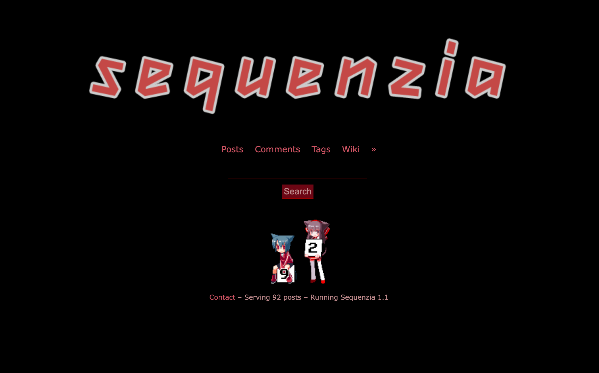

---
Sequenzia Legacy (Sequenzia LTS) is the first version of the Sequenzia Project and is a PHP implementation and fork of the myimouto project. 

This is only here for history and as a working reference of the original project, Do not expect any updates whatsoever to this version and all efforts are twards the new [Sequenzia Project](https://github.com/UiharuKazari2008/sequenzia-compose)

# Installation
```shell
docker compose up
```

# Build
```shell
git pull &&
docker build --no-cache -t kihara/sequenzia-legacy:latest ./sequenzia-php &&
docker compose down &&
docker compose build --no-cache &&
docker compose up -d &&
docker system prune -f
```
